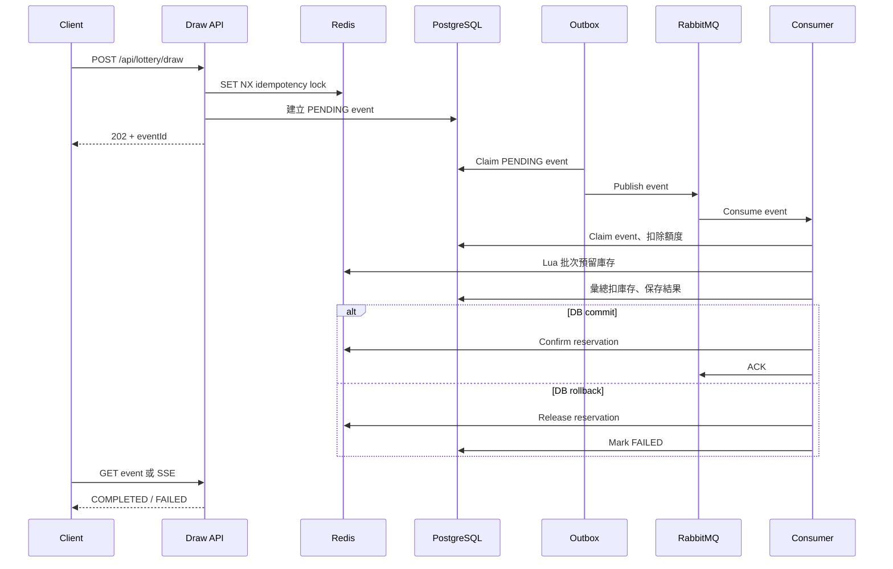

# Lottery Service

[English](README_EN.md) | 繁體中文

這是一個以 Spring Boot 建立的非同步抽獎系統，整合 Keycloak、PostgreSQL、Redis 與 RabbitMQ。

## 專案結構

- `common`：共用 response、exception 與錯誤處理。
- `user`：管理本地使用者資料，並透過 Keycloak 處理驗證、角色與使用者詳細資料。
- `lottery`：管理活動、獎項、抽獎事件、庫存與抽獎紀錄。
- `init-service`：Docker Compose、Keycloak realm、PostgreSQL 初始化腳本及 API 範例。

## 環境需求

- Java 26
- Spring Boot 4
- Docker 與 Docker Compose
- Keycloak 26.4
- PostgreSQL 17
- Redis 8
- RabbitMQ 4

## 啟動服務

從專案根目錄執行：

```bash
./dev.sh
```

此指令會啟動 PostgreSQL、Redis、Keycloak、RabbitMQ、User Service（port `8082`）及 Lottery Service（port `8080`）。也可以分開啟動：

```bash
docker compose -f init-service/docker-compose.yml up -d
./gradlew :user:bootRun
./gradlew :lottery:bootRun
```

## 整體使用流程

```text
建立 Keycloak 使用者
    ↓
設定 NORMAL_USER 或 ADMIN 角色
    ↓
登入並取得 access token
    ↓
建立／取得本地 user
    ↓
ADMIN 建立活動與獎項
    ↓
ADMIN 啟用活動
    ↓
使用者查詢活動並送出抽獎
    ↓
使用 eventId 查詢結果或訂閱 SSE
```

### 1. 建立 Keycloak 使用者

`lottery` realm 已開放自行註冊。也可以由管理員建立使用者：

1. 開啟 [Keycloak Admin Console](http://localhost:8081/admin)。
2. 使用開發環境管理員登入：Username `admin`、Password `admin`。
3. 切換至 `lottery` realm。
4. 進入 `Users`，選擇 `Create new user`。
5. 填寫 username、email、first name 與 last name。
6. 在 `Credentials` 設定密碼；開發測試時可關閉 `Temporary`。

新使用者會透過 `default-roles-lottery` 自動取得 `NORMAL_USER`。

### 2. 從 Keycloak 設定 ADMIN

1. 在 `lottery` realm 進入 `Users`。
2. 選擇目標使用者並開啟 `Role mapping`。
3. 選擇 `Assign role`，指派 realm role `ADMIN`。
4. 讓使用者重新登入，以取得包含新角色的 access token。

Realm export 內建開發用管理員：Username `lottery_admin`、Password `password`。

> 角色只保存在 Keycloak，不會複製到 `app_user`。Lottery 與 User Service 直接從 JWT authorities 判斷權限。

### 3. 建立或同步本地使用者

使用者登入後呼叫：

```http
GET http://localhost:8082/api/users/me
Authorization: Bearer <access-token>
```

若 `keycloak_subject` 尚不存在，User Service 會用 token 中的 subject、username 與 email 建立本地資料；已存在則直接回傳。本地 DB 用於快速搜尋與擴充業務資料，不需要依賴 Keycloak 的搜尋能力。

ADMIN 也可以同步更新 Keycloak 與本地共用欄位：

```http
PUT http://localhost:8082/api/keycloak/users/{keycloakUserId}
Authorization: Bearer <admin-access-token>
Content-Type: application/json

{
  "username": "alice",
  "email": "alice@example.com",
  "firstName": "Alice",
  "lastName": "Chen",
  "displayName": "Alice Chen",
  "enabled": true,
  "roles": ["NORMAL_USER"],
  "attributes": {"locale": ["zh-TW"]}
}
```

`username`、`email`、`displayName` 與 `enabled` 會同步至 `app_user`；角色仍只保存在 Keycloak。`service-account-user-service` 必須具備 `manage-users`、`view-users` 及 `view-realm`，本專案的 realm export 已包含這些權限。

### 4. 建立活動

只有 `ADMIN` 可以建立活動：

```http
POST http://localhost:8080/api/admin/campaigns
Authorization: Bearer <admin-access-token>
Content-Type: application/json

{
  "campaignCode": "ANNIVERSARY_2026",
  "name": "2026 週年慶幸運抽獎",
  "maxDrawsPerUser": 5,
  "startsAt": "2026-01-01T00:00:00Z",
  "endsAt": "2030-12-31T23:59:59Z"
}
```

活動建立後狀態為 `DRAFT`。`data.id` 是字串格式，避免 JavaScript 解析 Snowflake `Long` 時發生精度損失。

### 5. 新增獎項

可以逐筆呼叫 `POST /api/admin/campaigns/{campaignId}/prizes`，或在同一個 transaction 中一次建立全部獎項：

```http
POST http://localhost:8080/api/admin/campaigns/{campaignId}/prizes/batch
Authorization: Bearer <admin-access-token>
Content-Type: application/json

{
  "prizes": [
    {
      "prizeCode": "FIRST_PRIZE",
      "name": "iPhone",
      "prizeType": "PRIZE",
      "probability": 0.01,
      "totalStock": 10,
      "displayOrder": 1,
      "enabled": true
    },
    {
      "prizeCode": "SECOND_PRIZE",
      "name": "AirPods",
      "prizeType": "PRIZE",
      "probability": 0.04,
      "totalStock": 50,
      "displayOrder": 2,
      "enabled": true
    },
    {
      "prizeCode": "THIRD_PRIZE",
      "name": "超商禮券",
      "prizeType": "PRIZE",
      "probability": 0.15,
      "totalStock": 200,
      "displayOrder": 3,
      "enabled": true
    },
    {
      "prizeCode": "NO_PRIZE",
      "name": "銘謝惠顧",
      "prizeType": "NO_PRIZE",
      "probability": 0.80,
      "totalStock": 0,
      "displayOrder": 4,
      "enabled": true
    }
  ]
}
```

批次建立任一筆失敗時會整批 rollback；response 中每個獎項都包含字串格式的 `id`。

### 6. 啟用活動

活動啟用規則：

- 剛好 3 個啟用的 `PRIZE`。
- 剛好 1 個啟用的 `NO_PRIZE`。
- 所有啟用獎項的機率總和等於 `1.0`。
- 每個實體獎項的總庫存大於 0。

```http
POST http://localhost:8080/api/admin/campaigns/{campaignId}/activate
Authorization: Bearer <admin-access-token>
```

只有 `ACTIVE` 且目前時間位於 `startsAt` 與 `endsAt` 之間的活動會出現在可用清單。

### 7. 查詢活動並抽獎

```http
GET http://localhost:8080/api/lottery/campaigns
Authorization: Bearer <access-token>
```

```http
POST http://localhost:8080/api/lottery/draw
Authorization: Bearer <access-token>
Content-Type: application/json

{
  "requestId": "550e8400-e29b-41d4-a716-446655440000",
  "campaignId": "123456789",
  "drawCount": 1
}
```

`requestId` 是呼叫端產生的冪等鍵。同一操作因 timeout 或網路錯誤重試時必須沿用相同值；新抽獎才產生新值，建議使用 UUID。API 回傳 HTTP `202 Accepted` 與 `eventId`，表示請求已接受，但抽獎尚未完成。

查詢結果或訂閱 SSE：

```http
GET http://localhost:8080/api/lottery/events/{eventId}
Authorization: Bearer <access-token>
```

```http
GET http://localhost:8080/api/lottery/events/{eventId}/stream
Authorization: Bearer <access-token>
Accept: text/event-stream
```

查詢自己的抽獎紀錄：

```http
GET http://localhost:8080/api/lottery/users/me/draws?campaignId={campaignId}&limit=20
Authorization: Bearer <access-token>
```

## Draw 程式流程

`/draw` 採用 asynchronous event 與 transactional outbox。API thread 只建立事件，真正的抽獎由 RabbitMQ consumer 執行。



### 1. 驗證與冪等鎖

`DrawService.submit()` 先驗證 request，再以 Redis `SET NX` 建立 `lottery:idempotency:{requestId}`。鎖的 value 是本次請求專屬的隨機 token。

建立 event 失敗時會執行 `release-idempotency-lock.lua`：

```lua
if redis.call('GET', KEYS[1]) == ARGV[1] then
    return redis.call('DEL', KEYS[1])
end
return 0
```

Lua 在同一個原子操作中確認 token 並刪除鎖，防止舊請求誤刪已被新請求重新取得的鎖。PostgreSQL 的 `lottery_event.request_id` unique constraint 是最終冪等保護。

### 2. 建立事件與 Outbox 發送

API 在 PostgreSQL 建立 `PENDING` 的 `lottery_event` 並立即回傳 `eventId`。`LotteryOutboxPublisher` 定期：

1. 查詢 `PENDING` events 並原子 claim 為 `DISPATCHING`。
2. 發送至 RabbitMQ，等待 publisher confirm。
3. 成功後標記 `PUBLISHED`；失敗則以 exponential backoff 重新排程。

### 3. Consumer claim 與額度扣除

`LotteryDrawConsumer` 收到訊息後：

1. 將 event 原子 claim 為 `PROCESSING`，避免重複訊息執行兩次。
2. 再次確認活動為 `ACTIVE` 且位於有效期間。
3. 以原子 SQL 確認 `usedDraws + drawCount <= maxDrawsPerUser`。

### 4. 抽獎與 Redis Lua 庫存預留

系統先在記憶體完成所有隨機選擇，再依 `prizeId` 彙總。一次抽 100 次但只選到 3 種實體獎項時，後續最多處理 3 組庫存，不會執行 100 次 SQL。

`reserve-prize-stock.lua` 會原子完成：

1. 相同 `eventId` 重試時回傳既有 reservation，不重複扣庫存。
2. 以 `min(available, requested)` 計算實際預留數量。
3. 使用 `DECRBY` 扣除 Redis stock cache。
4. 保存預留明細並標記 `PENDING`。
5. 加入 pending sorted set，供 cleanup job 處理逾期資料。

庫存不足的候選結果會改為 `NO_PRIZE`。Redis unavailable 時會安全降級為 PostgreSQL 彙總扣除。

### 5. DB transaction 與 reservation 結果

同一個 DB transaction 會按 prize ID 彙總扣庫存、批次保存 `lottery_draw`，並寫入 event result。

- Commit：執行 `confirm-prize-stock.lua`，將 `PENDING` 改為 `CONFIRMED`。
- Rollback：執行 `release-prize-stock.lua`，以 `INCRBY` 原子歸還庫存。

### 6. 清理逾期 reservation

若 application 在 Redis 預留後 crash，callback 可能來不及執行。`PrizeStockReservationService.cleanupExpiredReservations()` 會定期掃描：

- DB event 為 `COMPLETED`：confirm，不歸還庫存。
- Event 不存在、失敗或逾期未完成：release 並歸還庫存。

```yaml
app:
  lottery:
    draw:
      stock-reservation-ttl: 10m
      stock-reservation-cleanup-interval: 1m
```

Redis stock cache 也有 TTL，到期後會從 PostgreSQL `remaining_stock` 重新初始化，作為最終自我修復機制。

### 7. MQ ACK 與錯誤處理

- 成功：cache result 並 ACK。
- 可預期業務錯誤：標記 `FAILED` 後 ACK，避免無效重試。
- 非預期 runtime error：標記 `FAILED` 後重新拋出，交由 RabbitMQ retry/dead-letter 處理。

## 範例活動

[init-service/campaign-requests.http](init-service/campaign-requests.http) 會建立並啟用 `ANNIVERSARY_2026` 與 `MID_AUTUMN_2026`。

1. 啟動所有服務。
2. 以 `lottery_admin` 登入並取得 `ADMIN` access token。
3. 開啟 request file，替換 `adminToken`。
4. 由上到下執行 requests。

Campaign code 具有 unique constraint。若要重複執行，請先刪除原活動或更換 code。

## Swagger

- Lottery Service：<http://localhost:8080/swagger/v1/lottery>
- User Service：<http://localhost:8082/swagger/v1/user>

## 清空並重新初始化 Docker 環境

> 以下指令會永久刪除 PostgreSQL、Redis 與 RabbitMQ volumes，包括 Keycloak users、活動、獎項、抽獎紀錄、cache 與 queues。

```bash
docker compose -f init-service/docker-compose.yml down --volumes --remove-orphans
docker compose -f init-service/docker-compose.yml up -d --force-recreate
```

這會重建 `postgres-data`、`redis-data` 與 `rabbitmq-data`。確認服務狀態：

```bash
docker compose -f init-service/docker-compose.yml ps
docker compose -f init-service/docker-compose.yml logs -f postgres keycloak
```

PostgreSQL 與 Keycloak 就緒後重新執行 `./dev.sh`。Liquibase 會重建 application schema，Keycloak 會重新匯入 realm；重置前簽發的 tokens 全部失效。

## 測試與 JaCoCo

```bash
./gradlew :lottery:test
```

Test task 會自動產生：

- HTML：`lottery/build/reports/jacoco/test/html/index.html`
- XML：`lottery/build/reports/jacoco/test/jacocoTestReport.xml`

也可以執行 `./gradlew :lottery:jacocoTestReport`。Service unit tests 使用 mocks，不需要啟動 Docker 或外部服務。
