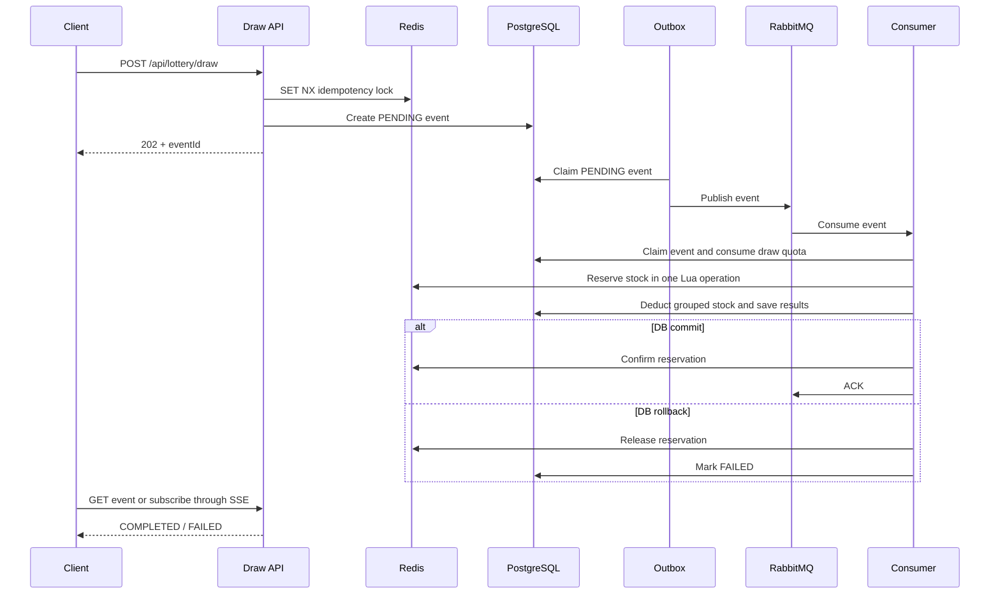

# Lottery Service

English | [繁體中文](README.md)

An asynchronous lottery system built with Spring Boot and integrated with Keycloak, PostgreSQL, Redis, and RabbitMQ.

## Project Structure

- `common`: Shared responses, exceptions, and error handling.
- `user`: Manages local user data and uses Keycloak for authentication, roles, and identity details.
- `lottery`: Manages campaigns, prizes, draw events, inventory, and draw history.
- `init-service`: Contains Docker Compose configuration, the Keycloak realm export, PostgreSQL initialization scripts, and API examples.

## Requirements

- Java 26
- Spring Boot 4
- Docker and Docker Compose
- Keycloak 26.4
- PostgreSQL 17
- Redis 8
- RabbitMQ 4

## Starting the Services

Run the following command from the project root:

```bash
./dev.sh
```

This starts PostgreSQL, Redis, Keycloak, RabbitMQ, User Service on port `8082`, and Lottery Service on port `8080`. You can also start them separately:

```bash
docker compose -f init-service/docker-compose.yml up -d
./gradlew :user:bootRun
./gradlew :lottery:bootRun
```

## End-to-End Usage Flow

```text
Create a Keycloak user
    ↓
Assign the NORMAL_USER or ADMIN role
    ↓
Sign in and obtain an access token
    ↓
Create or retrieve the local user
    ↓
ADMIN creates a campaign and its prizes
    ↓
ADMIN activates the campaign
    ↓
The user lists campaigns and submits a draw
    ↓
Use eventId to query the result or subscribe through SSE
```

### 1. Create a Keycloak User

Self-registration is enabled for the `lottery` realm. An administrator can also create a user manually:

1. Open the [Keycloak Admin Console](http://localhost:8081/admin).
2. Sign in with the development administrator account: username `admin`, password `admin`.
3. Switch to the `lottery` realm.
4. Open `Users` and select `Create new user`.
5. Enter the username, email, first name, and last name.
6. Set a password under `Credentials`. For local testing, you can disable `Temporary`.

New users automatically receive the `NORMAL_USER` role through `default-roles-lottery`.

### 2. Assign the ADMIN Role in Keycloak

1. Open `Users` in the `lottery` realm.
2. Select the target user and open `Role mapping`.
3. Select `Assign role` and assign the `ADMIN` realm role.
4. Ask the user to sign in again so that the new access token contains the updated role.

The realm export includes a development administrator: username `lottery_admin`, password `password`.

> Roles are stored only in Keycloak and are not duplicated in `app_user`. Lottery Service and User Service authorize requests from JWT authorities.

### 3. Create or Synchronize the Local User

After signing in, call:

```http
GET http://localhost:8082/api/users/me
Authorization: Bearer <access-token>
```

If the `keycloak_subject` does not exist, User Service creates a local record from the token subject, username, and email. Otherwise, it returns the existing record. The local database supports fast searches and future business-data extensions without depending on Keycloak's search capabilities.

An administrator can also update fields shared by Keycloak and the local database:

```http
PUT http://localhost:8082/api/keycloak/users/{keycloakUserId}
Authorization: Bearer <admin-access-token>
Content-Type: application/json

{
  "username": "alice",
  "email": "alice@example.com",
  "firstName": "Alice",
  "lastName": "Chen",
  "displayName": "Alice Chen",
  "enabled": true,
  "roles": ["NORMAL_USER"],
  "attributes": {"locale": ["en-US"]}
}
```

The `username`, `email`, `displayName`, and `enabled` fields are synchronized to `app_user`. Roles remain exclusively in Keycloak. The `service-account-user-service` account requires the `manage-users`, `view-users`, and `view-realm` roles; these permissions are included in the project realm export.

### 4. Create a Campaign

Only an `ADMIN` can create a campaign:

```http
POST http://localhost:8080/api/admin/campaigns
Authorization: Bearer <admin-access-token>
Content-Type: application/json

{
  "campaignCode": "ANNIVERSARY_2026",
  "name": "2026 Anniversary Lucky Draw",
  "maxDrawsPerUser": 5,
  "startsAt": "2026-01-01T00:00:00Z",
  "endsAt": "2030-12-31T23:59:59Z"
}
```

A newly created campaign has the `DRAFT` status. `data.id` is returned as a string to prevent JavaScript precision loss when parsing Snowflake `Long` values.

### 5. Add Prizes

Call `POST /api/admin/campaigns/{campaignId}/prizes` to add one prize, or create all prizes in a single transaction with:

```http
POST http://localhost:8080/api/admin/campaigns/{campaignId}/prizes/batch
Authorization: Bearer <admin-access-token>
Content-Type: application/json

{
  "prizes": [
    {
      "prizeCode": "FIRST_PRIZE",
      "name": "iPhone",
      "prizeType": "PRIZE",
      "probability": 0.01,
      "totalStock": 10,
      "displayOrder": 1,
      "enabled": true
    },
    {
      "prizeCode": "SECOND_PRIZE",
      "name": "AirPods",
      "prizeType": "PRIZE",
      "probability": 0.04,
      "totalStock": 50,
      "displayOrder": 2,
      "enabled": true
    },
    {
      "prizeCode": "THIRD_PRIZE",
      "name": "Gift Card",
      "prizeType": "PRIZE",
      "probability": 0.15,
      "totalStock": 200,
      "displayOrder": 3,
      "enabled": true
    },
    {
      "prizeCode": "NO_PRIZE",
      "name": "Better Luck Next Time",
      "prizeType": "NO_PRIZE",
      "probability": 0.80,
      "totalStock": 0,
      "displayOrder": 4,
      "enabled": true
    }
  ]
}
```

If any item fails, the entire batch is rolled back. Every prize in the response includes its `id` as a string.

### 6. Activate the Campaign

A campaign can be activated only when it meets all of these rules:

- Exactly three enabled `PRIZE` items exist.
- Exactly one enabled `NO_PRIZE` item exists.
- The probabilities of all enabled items add up to `1.0`.
- Every physical prize has a total stock greater than zero.

```http
POST http://localhost:8080/api/admin/campaigns/{campaignId}/activate
Authorization: Bearer <admin-access-token>
```

Only `ACTIVE` campaigns whose current time is between `startsAt` and `endsAt` appear in the available campaign list.

### 7. List Campaigns and Submit a Draw

```http
GET http://localhost:8080/api/lottery/campaigns
Authorization: Bearer <access-token>
```

```http
POST http://localhost:8080/api/lottery/draw
Authorization: Bearer <access-token>
Content-Type: application/json

{
  "requestId": "550e8400-e29b-41d4-a716-446655440000",
  "campaignId": "123456789",
  "drawCount": 1
}
```

`requestId` is an idempotency key generated by the caller. Reuse the same value when retrying the same operation after a timeout or network error, and generate a new value only for a new draw. A UUID is recommended. The API returns HTTP `202 Accepted` with an `eventId`, which means that the request was accepted but the draw has not necessarily completed.

Query the result or subscribe through SSE:

```http
GET http://localhost:8080/api/lottery/events/{eventId}
Authorization: Bearer <access-token>
```

```http
GET http://localhost:8080/api/lottery/events/{eventId}/stream
Authorization: Bearer <access-token>
Accept: text/event-stream
```

Query the current user's draw history:

```http
GET http://localhost:8080/api/lottery/users/me/draws?campaignId={campaignId}&limit=20
Authorization: Bearer <access-token>
```

## Draw Processing Flow

The `/draw` endpoint uses asynchronous events and a transactional outbox. The API thread only creates the event; a RabbitMQ consumer performs the actual draw.



### 1. Validation and Idempotency Lock

`DrawService.submit()` validates the request and then uses Redis `SET NX` to create `lottery:idempotency:{requestId}`. The value is a random token unique to the current request.

If event creation fails, the service executes `release-idempotency-lock.lua`:

```lua
if redis.call('GET', KEYS[1]) == ARGV[1] then
    return redis.call('DEL', KEYS[1])
end
return 0
```

The Lua script compares the token and deletes the lock atomically. This prevents an older request from deleting a lock that a newer request has already acquired. The unique constraint on PostgreSQL `lottery_event.request_id` provides the final idempotency guarantee.

### 2. Event Creation and Outbox Delivery

The API creates a `PENDING` `lottery_event` in PostgreSQL and immediately returns its `eventId`. `LotteryOutboxPublisher` periodically:

1. Finds `PENDING` events and atomically claims them as `DISPATCHING`.
2. Publishes them to RabbitMQ and waits for publisher confirmation.
3. Marks successful deliveries as `PUBLISHED`, or reschedules failures with exponential backoff.

### 3. Consumer Claim and Draw Quota

After receiving a message, `LotteryDrawConsumer`:

1. Atomically claims the event as `PROCESSING`, preventing duplicate messages from running it twice.
2. Verifies again that the campaign is `ACTIVE` and within its valid time range.
3. Uses an atomic SQL statement to verify that `usedDraws + drawCount <= maxDrawsPerUser`.

### 4. Prize Selection and Redis Lua Stock Reservation

The service first performs all random selections in memory and groups the results by `prizeId`. If 100 draws select only three physical prize types, the following stock operation handles at most three groups instead of executing 100 SQL statements.

`reserve-prize-stock.lua` atomically:

1. Returns an existing reservation when the same `eventId` is retried, without deducting stock twice.
2. Calculates the reserved quantity as `min(available, requested)`.
3. Deducts the Redis stock cache with `DECRBY`.
4. Stores the reservation details with the `PENDING` status.
5. Adds the reservation to a pending sorted set for the cleanup job.

Candidates without enough stock are converted to `NO_PRIZE`. If Redis is unavailable, the service safely falls back to grouped PostgreSQL stock deductions.

### 5. Database Transaction and Reservation Outcome

The same database transaction deducts stock grouped by prize ID, saves `lottery_draw` records in a batch, and stores the event result.

- On commit, `confirm-prize-stock.lua` changes the reservation from `PENDING` to `CONFIRMED`.
- On rollback, `release-prize-stock.lua` atomically restores stock with `INCRBY`.

### 6. Expired Reservation Cleanup

If the application crashes after reserving Redis stock, its transaction callback may never run. `PrizeStockReservationService.cleanupExpiredReservations()` periodically handles these cases:

- If the database event is `COMPLETED`, it confirms the reservation without restoring stock.
- If the event does not exist, has failed, or remains incomplete after its timeout, it releases the reservation and restores stock.

```yaml
app:
  lottery:
    draw:
      stock-reservation-ttl: 10m
      stock-reservation-cleanup-interval: 1m
```

The Redis stock cache also has a TTL. After expiration, it is initialized again from PostgreSQL `remaining_stock`, providing eventual self-recovery.

### 7. MQ Acknowledgment and Error Handling

- Success: cache the result and acknowledge the message.
- Expected business error: mark the event as `FAILED` and acknowledge it to avoid an invalid retry.
- Unexpected runtime error: mark the event as `FAILED` and rethrow the error for RabbitMQ retry and dead-letter processing.

## Example Campaigns

[init-service/campaign-requests.http](init-service/campaign-requests.http) creates and activates `ANNIVERSARY_2026` and `MID_AUTUMN_2026`.

1. Start all services.
2. Sign in as `lottery_admin` and obtain an access token with the `ADMIN` role.
3. Open the request file and replace `adminToken`.
4. Run the requests from top to bottom.

Campaign codes have a unique constraint. Delete the existing campaign or change its code before running the same creation request again.

## Swagger

- Lottery Service: <http://localhost:8080/swagger/v1/lottery>
- User Service: <http://localhost:8082/swagger/v1/user>

## Resetting and Reinitializing the Docker Environment

> The following commands permanently delete the PostgreSQL, Redis, and RabbitMQ volumes, including Keycloak users, campaigns, prizes, draw history, caches, and queues.

```bash
docker compose -f init-service/docker-compose.yml down --volumes --remove-orphans
docker compose -f init-service/docker-compose.yml up -d --force-recreate
```

This recreates `postgres-data`, `redis-data`, and `rabbitmq-data`. Check the service status with:

```bash
docker compose -f init-service/docker-compose.yml ps
docker compose -f init-service/docker-compose.yml logs -f postgres keycloak
```

After PostgreSQL and Keycloak are ready, run `./dev.sh` again. Liquibase recreates the application schema, Keycloak imports the realm, and all tokens issued before the reset become invalid.

## Tests and JaCoCo

```bash
./gradlew :lottery:test
```

The test task automatically generates:

- HTML: `lottery/build/reports/jacoco/test/html/index.html`
- XML: `lottery/build/reports/jacoco/test/jacocoTestReport.xml`

You can also run `./gradlew :lottery:jacocoTestReport`. Service unit tests use mocks and do not require Docker or other external services.
